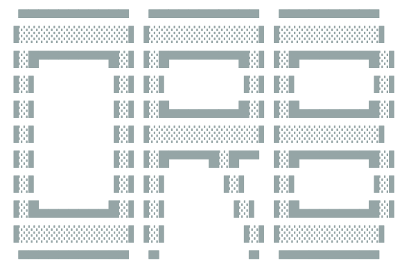

<!-- PROJECT LOGO -->
 

  

    An Intel 1702A Emulator for the Sphere-1 CPU/2 Board
      

    <strong>
    "Optional ROM Board"
    </strong>

<!-- ABOUT THE PROJECT -->
## About The Project

Whilst building the reproduction CPU/2, I found (not a surprise) that some of the parts are becoming increasingly rare and expensive to find. One clear example of this is the Intel 1702A EPROMs.

These chips are integral to the CPU/2 board, as they contain the “Operating System” for the whole computer.

Project ORB, then, is a project to allow these chips to be simulated, and therefore not require expensive replacement chips.

## Contributing

Contributions are what make the open source community such an amazing place to learn, inspire, and create. Any contributions you make are **greatly appreciated**.

If you have a suggestion or a resource that would help me, or perhaps you see something I've got wrong, please create an Issue. 

<!-- LICENSE 
## License

Distributed under the MIT License. See `LICENSE.txt` for more information.
-->

<!-- CONTACT -->
## Contact

eMail [Andrew Shapton](mailto:alshapton@gmail.com)

<!-- ACKNOWLEDGMENTS -->
## Acknowledgments

I have to give my heartfelt thanks to Ben Zotto, who has been a sounding board for me throughout this project, answering my emails, and checking his Sphere-1 CPU/2 board to answer questions, and offering thoughts as to why things “were like they were” ! Without him, I would never have got as far as I have.
